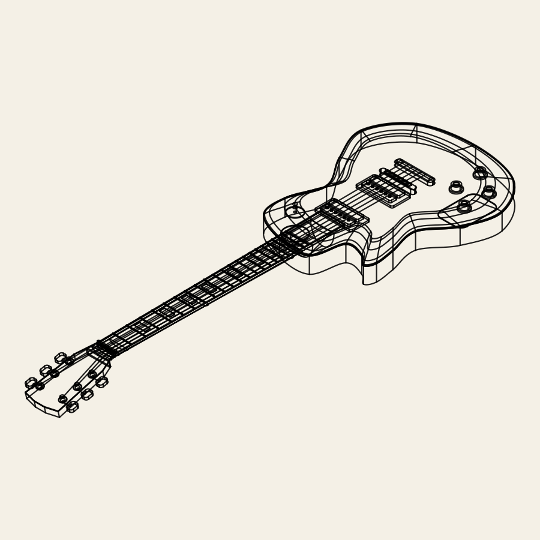

# HeliosCAD

Helios is a human-facing 3D design studio using the public `@aetheris/cad` browser runtime. Leviathan owns sign-in, accounts, project ownership, revision metadata, and object storage. Firmament source is the saved project truth; the editor rebuilds geometry and exports STEP from that source.

## Showcase and community

The root opens a curated, anonymous showcase. Five real projects demonstrate a mounting plate, CODEX threaded bolt, Industrial ATLAS, sunburst electric guitar, and warm-modern house. Source documents load on demand; multi-file projects preserve includes, shared definitions and Scene cameras. The welcome screen does not initialize the geometry runtime. See [the showcase guide](docs/public/helios-showcase.md).



The front page uses bold monochrome SVG model cards, large Inter lettering and a minimal header. White Sirius is the default; Mars retains the original dark green and gold palette. Theme choice is shared with the editor and persists across reloads. Regenerate the cards with `dotnet run --project scripts/wireframes -c Release -- .`. Source and wireframe provenance is recorded in [the showcase manifest](fixtures/showcase/README.md). Browser qualification captures stay in `artifacts/local/p4-03/`.

`/discover` retains the community gallery backed by Leviathan, and `/projects` retains saved cloud projects. Community publications and anonymous forks keep their existing ownership and authentication flow. Cloud projects still store one source document; local showcase workspaces hold explicit source files in memory and download source to disk. They do not imply cloud persistence.

## Editor architecture

The active Firmament document is edited with Monaco in `src/source/SourcePanel.tsx`. Monaco owns cursor, selection, undo, indentation, and the visible markers. `src/source/FirmamentLanguageClient.ts` is the one adapter from the editor to the public Aetheris Web SDK LX contract. A page-thread runtime handles only completion and schema queries so completion does not wait behind a geometry build. `src/sdk/AetherisWorkerClient.ts` serializes heavy builds through one dedicated Aetheris WebAssembly Worker, retaining only the newest pending request. The SDK transfers mesh buffers and STEP bytes; the main thread keeps display, picking, project state, and save/reopen UI. Source and display revisions are shown separately, and late build results cannot replace newer source state. The selected model's source map still drives Go to Source and source cursor selection. Typing does not rebuild geometry. See [the Worker X1 report](docs/release/WEB-RUNTIME-WORKER-X1.md).

The Aetheris language service provides completion, semantic tokens, hover, live diagnostics, same-document definitions and canonical formatting. Compiled source references also support navigation from diagnostics and selected objects. No frontend Firmament parser is used. Monaco markers and Problems retain precise compiler messages; failed builds keep the last valid geometry and mark it out of date.

The workspace has resizable source/viewport and bottom panes, a collapsible utility dock, Files, Inspector, Examples and AI Author. Self-hosted Inter is used throughout, including Monaco and the terminal. Wrap above the editor, or Alt+Z, toggles a remembered word-wrap preference. AI Author visibly prepares the propose/review/apply/build workflow for P4-04; no provider is connected. STEP is available for successfully built Parts and Assemblies. Scene STEP and browser GLB/USD are not offered because the active SDK does not expose those paths.

## Local development

Run `npm run dev -- --host 127.0.0.1` and open `http://127.0.0.1:4173/` for the showcase without an account or Leviathan. `/local` opens the bracket editor directly and is also available in the production bundle. The optional Terminal · local tab runs PowerShell only through the Vite development server on loopback. A built browser deployment has no terminal tab.

Refresh canonical source copies with `node scripts/sync-showcase.mts`; the manifest records upstream paths and SHA-256 hashes. Keep generated screenshots and downloads under ignored `artifacts/local/`.
The ATLAS example now uses source-owned rigid components, keyed hardware sites and five articulated/mounting interfaces. Its ten canonical modules and native wireframe are synchronized together; see [the construction and qualification notes](../Aetheris/docs/public/demos/industrial-atlas-modernization.md).

Keep `HeliosCAD`, `Leviathan`, and `Aetheris` as sibling checkouts. For local iteration, run `npm run sdk:install` to build the fast non-AOT Aetheris SDK tarball in `Aetheris/artifacts/local/helios-sdk`. The Vite dev server uses that runtime for both LX and the Worker. Then:

```powershell
cd ../Leviathan
$env:ASPNETCORE_ENVIRONMENT = 'Development'
$env:LEVIATHAN_DATA_DIR = Join-Path $PWD 'data-local'
dotnet run --project src/Leviathan.Server --no-launch-profile --urls http://127.0.0.1:5189
```

In a second terminal:

```powershell
cd ../HeliosCAD
npm run dev
```

Open `http://127.0.0.1:4173/discover` for the community. Vite proxies `/api` to Leviathan on port 5189. Local development uses an isolated SQLite query database and filesystem object store under `LEVIATHAN_DATA_DIR`. Use a fresh local data directory after a schema change; PostgreSQL migrations are the production schema path.

## Qualification

```powershell
npm test
npm run build:fast
npx playwright test --config playwright.showcase.config.ts
npm run test:e2e
```

The showcase configuration qualifies the real SDK/WebGPU paths in installed Edge without a backend. The existing cloud browser test launches Leviathan and Vite, then signs up, creates a project, edits and saves source, returns in a fresh Chrome profile, rebuilds, and exports STEP. It uses an isolated test database and requires installed Google Chrome. Server restart, account isolation, stale-save, and CSRF checks are in `Leviathan.Server.Tests`.

## Production deployment candidate

`compose.production.yaml` runs the ASP.NET server, PostgreSQL, and a Caddy HTTPS/static frontend. It requires an existing HTTPS S3-compatible bucket. Build the production frontend from the sibling Aetheris checkout with `npm run sdk:install:production` followed by `npm run build`; the install command creates the local SDK tarball before npm resolves Helios dependencies. The production bundle keeps standard WASM for page-thread LX and selects the .NET WASM AOT runtime for the geometry Worker. Run `npx playwright test --config playwright.production.config.ts` for local production-bundle qualification before publishing. Then set the required Compose variables in a private `.env` or secret source and run `docker compose -f compose.production.yaml up --build -d`. Configure the public DNS name in `HELIOS_HOST`. Keep the PostgreSQL, Leviathan data, and Caddy volumes durable and backed up. Caddy caches fingerprinted runtime assets as immutable and revalidates boot files after five minutes. Run `GET /health/ready` through the public hostname after startup. See [the runtime performance report](docs/release/WEB-RUNTIME-PERF-X1.md) for the measured AOT tradeoff and remaining tessellation limit.

The Compose file has passed configuration parsing, but no live production deployment or PostgreSQL/S3 integration test has run in this checkout. See [the X0 release report](docs/release/HELIOS-TELOS-X0.md) for the exact qualification boundary.
